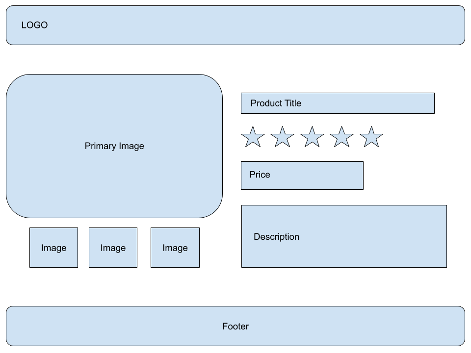

# Diem - Tech Test

In this repository, you'll find a bootstrapped Remix application, development server, and boilerplate assets.

Remix is owned and maintained by Shopify, so this will give you a fairly accurate representation of the tech stack we're using at Diem.

## Setup

At Diem, we using Node v18 LTS for our projects. Ensure you have this specific version installed on your machine. Ideally, make use of NVM to handle Node versioning. If you are using NVM, simply run `nvm use` in the root of the project once you've installed Node. More information on NVM can be found below:

https://github.com/nvm-sh/nvm

### Installation

Firstly, install all of the project dependencies using the following:

```bash
npm i
```

Once done, run the following command to start your local development server:

```bash
npm start
```

A local development will start, listening on port 3000. You can navigate to the following to start development:
http://localhost:3000/

## Overview

You will be building a simple product page using some mock data. Please use the wireframe below:



Product data will need to be requested from the following endpoint:

https://dummyjson.com/products/1

### Acceptance Criteria

- Using the wireframe as a starting point, create a simple product page layout, incorporating each section
- You have design freedom, show us how you would approach the layout of this page
- Ensure you request data from the endpoint listed above
- We want to see your approach to structuring the page using components
